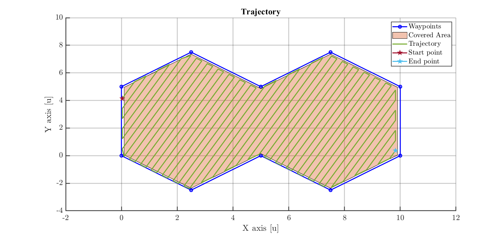

This repository presents an implementation of a coverage path planning algorithm for polygonal areas based on concavity-aware decomposition and scanline strategies.

The method is inspired by the work presented in the paper:

"A Concavity-Aware Decomposition Method for Coverage Path Planning"
Li, J., Sheng, H., Zhang, J., & Zhang, H. (2023)
https://doi.org/10.3390/aerospace10070755

The approach consists of:
- inward offsetting of the target area,
- decomposition of non-convex polygons based on concave vertices,
- generation of coverage trajectories using a scanline (lawnmower) pattern,
- and orientation alignment through geometric transformations.

Although originally motivated by aerial spraying applications (e.g., UAV-based agriculture), the proposed framework is general and can be applied to a wide range of coverage problems, including:
- robotic cleaning,
- inspection tasks,
- mapping and exploration,
- and autonomous ground or aerial vehicle navigation.

The repository includes an implementation in MATLAB, enabling algorithmic validation.

---

## 📊 Example

---

## 🛰️ Contact

If you have questions or want to collaborate, feel free to reach out:
**Tomás Suárez**
Mechatronics Engineer
📧 [suareztomasm@gmail.com](mailto:suareztomasm@gmail.com)
